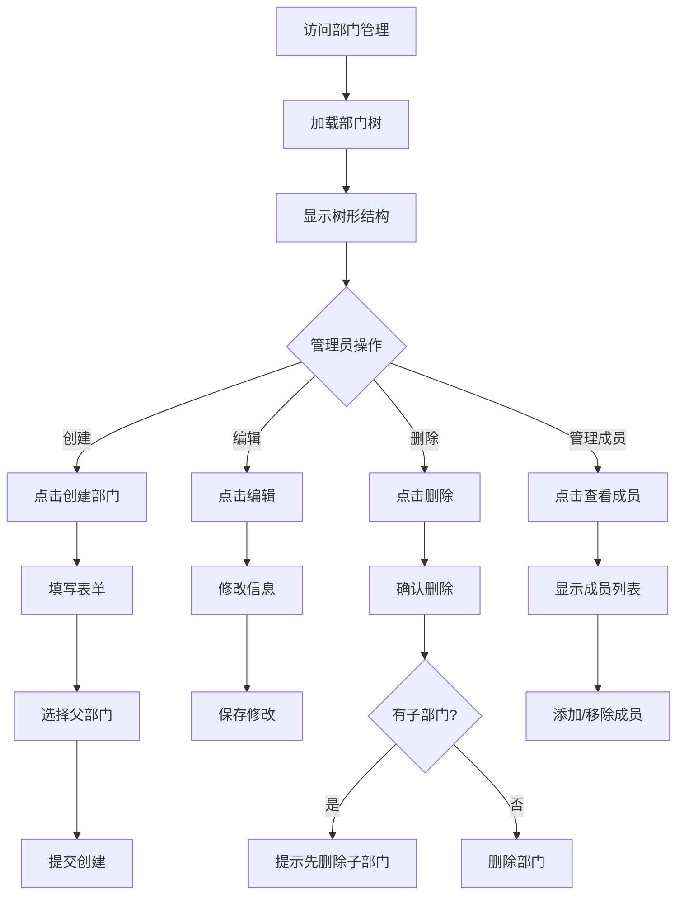

# 部门管理 - UI 设计文档

## 一、用户场景

### 目标用户
- 系统管理员：管理组织架构

### 用户目标
- 查看部门树形结构
- 创建/编辑/删除部门
- 管理部门成员
- 设置部门层级关系

### 使用场景
- 新建部门
- 调整组织架构
- 添加用户到部门
- 移除部门成员

## 二、用户旅程图



## 三、页面设计

### 3.1 页面布局

```
┌─────────────────────────────────────────────────────────────┐
│  部门管理                                                   │
│  管理组织架构和部门成员                                     │
│                                                             │
│  ┌─────────────────────────────────────────────────────┐   │
│  │                    + 创建部门                        │   │
│  └─────────────────────────────────────────────────────┘   │
│                                                             │
│  ┌─────────────────────────────────────────────────────────┐│
│  │ 📁 总公司                                    [编辑][删除]││
│  │   ├─ 📁 研发部                        [编辑][删除][成员]││
│  │   │   ├─ 📁 前端组                    [编辑][删除][成员]││
│  │   │   │   └─ 👤 张三、李四、王五...                   ││
│  │   │   └─ 📁 后端组                    [编辑][删除][成员]││
│  │   │       └─ 👤 赵六、钱七...                         ││
│  │   ├─ 📁 产品部                        [编辑][删除][成员]││
│  │   │   └─ 👤 孙八...                                   ││
│  │   └─ 📁 运营部                        [编辑][删除][成员]││
│  │       └─ 👤 周九、吴十...                             ││
│  └─────────────────────────────────────────────────────────┘│
│                                                             │
└─────────────────────────────────────────────────────────────┘
```

### 3.2 部门详情/成员管理

```
┌─────────────────────────────────────┐
│  研发部 - 成员管理            ✕    │
├─────────────────────────────────────┤
│                                     │
│  部门信息                           │
│  名称: 研发部                       │
│  描述: 负责产品研发                 │
│  成员数: 5                          │
│                                     │
│  成员列表                           │
│  ┌─────────────────────────────────┐│
│  │ 👤 张三  zhangsan@xx.com  [移除]││
│  │ 👤 李四  lisi@xx.com      [移除]││
│  │ 👤 王五  wangwu@xx.com    [移除]││
│  └─────────────────────────────────┘│
│                                     │
│  [添加成员]                         │
│                                     │
│         [关闭]                      │
│                                     │
└─────────────────────────────────────┘
```

## 四、状态设计

### 4.1 加载状态
- 显示 loading 动画
- 树形结构骨架屏

### 4.2 空数据状态
- 显示"暂无部门"
- 提供创建按钮

### 4.3 错误状态
- 显示错误提示
- 提供重试按钮

### 4.4 成功状态
- 操作成功后显示 Toast
- 自动刷新树形结构

## 五、API 依赖

| API | 用途 | 状态 |
|-----|------|------|
| GET /api/groups | 获取部门列表 | ✅ 已实现 |
| GET /api/groups/tree | 获取部门树 | ✅ 已实现 |
| POST /api/groups | 创建部门 | ✅ 已实现 |
| PUT /api/groups/{id} | 更新部门 | ✅ 已实现 |
| DELETE /api/groups/{id} | 删除部门 | ✅ 已实现 |
| GET /api/groups/{id}/members | 获取成员 | ✅ 已实现 |
| POST /api/groups/{id}/members | 添加成员 | ✅ 已实现 |
| DELETE /api/groups/{id}/members/{user_id} | 移除成员 | ✅ 已实现 |

## 六、业务规则

- 删除部门前必须先删除子部门
- 删除部门前必须先移除所有成员
- 用户可以属于多个部门
- 用户有一个主部门（is_primary）