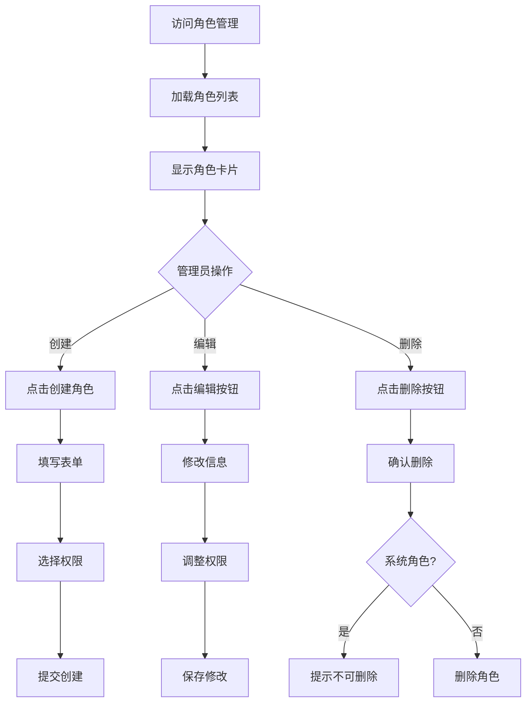

# 角色管理 - UI 设计文档

## 一、用户场景

### 目标用户
- 系统管理员：管理角色和权限

### 用户目标
- 查看系统角色
- 创建自定义角色
- 为角色分配权限
- 编辑/删除角色

### 使用场景
- 创建部门专属角色
- 调整角色权限
- 删除不再使用的角色

## 二、用户旅程图



## 三、页面设计

### 3.1 页面布局

```
┌─────────────────────────────────────────────────────────────┐
│  角色管理                                                   │
│  管理系统角色和权限                                         │
│                                                             │
│  ┌─────────────────────────────────────────────────────┐   │
│  │                    + 创建角色                        │   │
│  └─────────────────────────────────────────────────────┘   │
│                                                             │
│  ┌─────────────────┐ ┌─────────────────┐ ┌─────────────┐   │
│  │ admin           │ │ moderator       │ │ user        │   │
│  │ 系统管理员      │ │ 内容审核员      │ │ 普通用户    │   │
│  │                 │ │                 │ │             │   │
│  │ [admin]         │ │ [skills:read]   │ │ [skills:read]│   │
│  │ [users:read]    │ │ [skills:write]  │ │             │   │
│  │ [skills:read]   │ │                 │ │             │   │
│  │ ...             │ │                 │ │             │   │
│  │                 │ │                 │ │             │   │
│  │ [编辑] [删除]   │ │ [编辑] [删除]   │ │ [编辑]      │   │
│  └─────────────────┘ └─────────────────┘ └─────────────┘   │
│                                                             │
└─────────────────────────────────────────────────────────────┘
```

### 3.2 创建/编辑角色弹窗

```
┌─────────────────────────────────────┐
│  创建角色                    ✕     │
├─────────────────────────────────────┤
│                                     │
│  角色名称 *                         │
│  ┌─────────────────────────────┐    │
│  │ 部门管理员                  │    │
│  └─────────────────────────────┘    │
│                                     │
│  描述                               │
│  ┌─────────────────────────────┐    │
│  │ 部门级别管理员              │    │
│  └─────────────────────────────┘    │
│                                     │
│  权限                               │
│  [选择权限 ▼]        [添加]        │
│                                     │
│  ┌─────┐ ┌─────────┐ ┌────────┐    │
│  │skills│ │users:read│ │groups  │    │
│  └─────┘ └─────────┘ └────────┘    │
│                                     │
│         [取消]    [创建]           │
│                                     │
└─────────────────────────────────────┘
```

## 四、状态设计

### 4.1 加载状态
- 卡片区域显示 loading

### 4.2 空数据状态
- 显示"暂无角色"

### 4.3 错误状态
- 显示错误提示

### 4.4 成功状态
- 操作成功后显示 Toast
- 自动刷新列表

## 五、API 依赖

| API | 用途 | 状态 |
|-----|------|------|
| GET /api/roles | 获取角色列表 | ✅ 已实现 |
| POST /api/roles | 创建角色 | ✅ 已实现 |
| PUT /api/roles/{id} | 更新角色 | ✅ 已实现 |
| DELETE /api/roles/{id} | 删除角色 | ✅ 已实现 |
| GET /api/permissions | 获取权限列表 | ✅ 已实现 |

## 六、特殊规则

- 系统角色（admin, user）不可删除
- 系统角色权限不可修改（未来可实现）