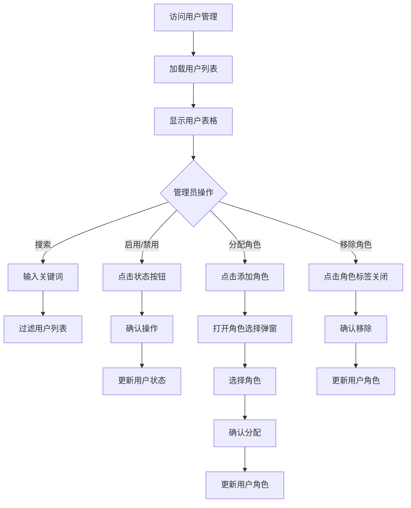

# 用户管理 - UI 设计文档

## 一、用户场景

### 目标用户
- 系统管理员：管理平台用户

### 用户目标
- 查看平台所有用户
- 管理用户状态（启用/禁用）
- 分配用户角色
- 查看用户详细信息

### 使用场景
- 新员工入职，分配账号和角色
- 用户离职，禁用账号
- 权限调整，修改用户角色
- 用户问题排查，查看用户信息

## 二、用户旅程图



## 三、页面设计

### 3.1 页面布局

```
┌─────────────────────────────────────────────────────────────┐
│  管理后台                                                   │
├─────────────────────────────────────────────────────────────┤
│  用户管理                                                   │
│  管理平台用户、分配角色                                     │
│                                                             │
│  ┌─────────────────────────────────────────────────────┐   │
│  │  🔍 搜索用户...                                      │   │
│  └─────────────────────────────────────────────────────┘   │
│                                                             │
│  ┌─────────────────────────────────────────────────────────┐│
│  │ 用户    │ 邮箱          │ 角色           │ 状态  │ 操作 ││
│  ├─────────────────────────────────────────────────────────┤│
│  │ 👤 admin│ admin@xx.com  │ [admin] [user] │ 启用  │禁用  ││
│  │ 👤 test │ test@xx.com   │ [user]         │ 禁用  │启用  ││
│  │ 👤 dev  │ dev@xx.com    │ [user] +添加   │ 启用  │禁用  ││
│  └─────────────────────────────────────────────────────────┘│
│                                                             │
└─────────────────────────────────────────────────────────────┘
```

### 3.2 角色分配弹窗

```
┌─────────────────────────────────────┐
│  分配角色                    ✕     │
├─────────────────────────────────────┤
│                                     │
│  为用户 "dev" 分配角色              │
│                                     │
│  ┌─────────────────────────────┐    │
│  │ ○ admin                     │    │
│  │   系统管理员，拥有所有权限   │    │
│  └─────────────────────────────┘    │
│                                     │
│  ┌─────────────────────────────┐    │
│  │ ● moderator                 │    │
│  │   内容审核员，管理技能内容   │    │
│  └─────────────────────────────┘    │
│                                     │
│  ┌─────────────────────────────┐    │
│  │ ○ user                      │    │
│  │   普通用户，基础权限         │    │
│  └─────────────────────────────┘    │
│                                     │
│         [取消]    [确认分配]        │
│                                     │
└─────────────────────────────────────┘
```

## 四、状态设计

### 4.1 加载状态
- 表格区域显示 loading
- 禁用搜索和操作

### 4.2 空数据状态
- 显示"暂无用户"
- 提供刷新按钮

### 4.3 错误状态
- 显示错误提示
- 提供重试按钮

### 4.4 成功状态
- 操作成功后显示 Toast
- 自动刷新列表

## 五、API 依赖

| API | 用途 | 状态 |
|-----|------|------|
| GET /api/users | 获取用户列表 | ✅ 已实现 |
| PUT /api/users/{id} | 更新用户状态 | ✅ 已实现 |
| POST /api/users/{id}/roles | 分配角色 | ✅ 已实现 |
| DELETE /api/users/{id}/roles/{role} | 移除角色 | ✅ 已实现 |

## 六、权限要求

| 操作 | 所需权限 |
|------|---------|
| 查看用户列表 | users:read |
| 启用/禁用用户 | users:write |
| 分配角色 | users:write |
| 移除角色 | users:write |