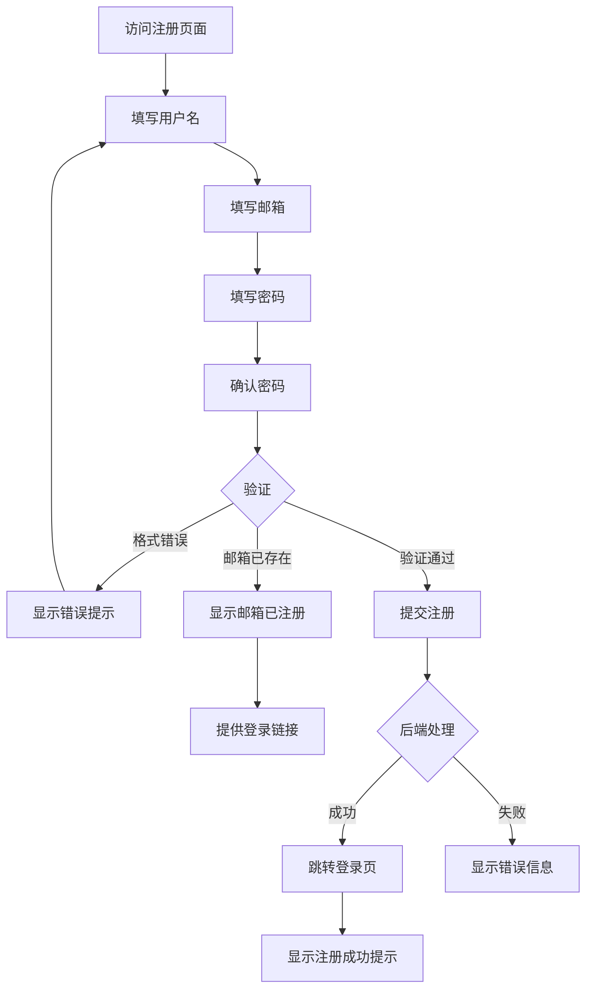
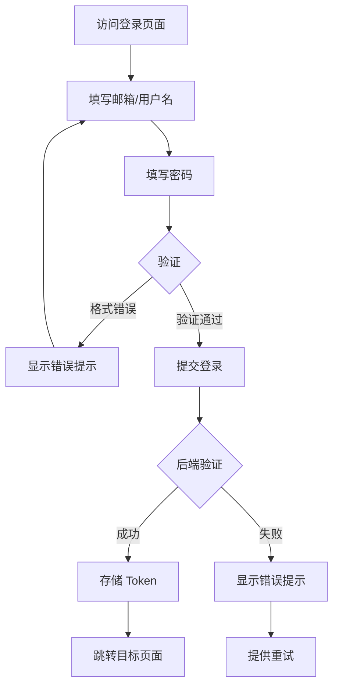

# 用户认证 - UI 设计文档

## 一、用户场景

### 目标用户
- 新用户：希望注册账号使用平台
- 已注册用户：希望登录访问个人资源

### 用户目标
- 快速完成注册/登录
- 获得清晰的操作反馈
- 在出错时得到明确的提示

### 使用场景
- 首次访问平台，需要注册
- 已有账号，需要登录
- Token 过期，需要重新登录
- 注册后需要激活（暂未实现）

## 二、用户旅程图

### 2.1 注册流程



### 2.2 登录流程



## 三、页面设计

### 3.1 登录页面布局

```
┌─────────────────────────────────────┐
│           Skills Hub Logo           │
│         技能智能管理平台              │
├─────────────────────────────────────┤
│                                     │
│  ┌─────────────────────────────┐    │
│  │        邮箱/用户名           │    │
│  └─────────────────────────────┘    │
│                                     │
│  ┌─────────────────────────────┐    │
│  │        密码            👁️   │    │
│  └─────────────────────────────┘    │
│  密码至少8个字符                     │
│                                     │
│  ┌─────────────────────────────┐    │
│  │         登 录               │    │
│  └─────────────────────────────┘    │
│                                     │
│  还没有账号？ 立即注册               │
│                                     │
└─────────────────────────────────────┘
```

### 3.2 注册页面布局

```
┌─────────────────────────────────────┐
│           Skills Hub Logo           │
│         技能智能管理平台              │
├─────────────────────────────────────┤
│                                     │
│  ┌─────────────────────────────┐    │
│  │        用户名               │    │
│  └─────────────────────────────┘    │
│  用户名最多50个字符                  │
│                                     │
│  ┌─────────────────────────────┐    │
│  │        邮箱                 │    │
│  └─────────────────────────────┘    │
│                                     │
│  ┌─────────────────────────────┐    │
│  │        密码            👁️   │    │
│  └─────────────────────────────┘    │
│  密码至少8个字符                     │
│                                     │
│  ┌─────────────────────────────┐    │
│  │        确认密码        👁️   │    │
│  └─────────────────────────────┘    │
│                                     │
│  ┌─────────────────────────────┐    │
│  │        创建账号             │    │
│  └─────────────────────────────┘    │
│                                     │
│  已有账号？ 立即登录                 │
│                                     │
└─────────────────────────────────────┘
```

### 3.3 交互流程

| 操作 | 系统响应 | 结果 |
|------|---------|------|
| 点击"登录"按钮 | 验证表单 → 发送请求 | 成功跳转 / 显示错误 |
| 点击"注册"按钮 | 验证表单 → 发送请求 | 跳转登录页 / 显示错误 |
| 点击"显示密码"图标 | 切换密码可见性 | 明文/密文切换 |
| 输入无效邮箱 | 前端验证 | 显示格式错误 |
| 密码不匹配 | 前端验证 | 显示不匹配提示 |

## 四、状态设计

### 4.1 加载状态
- **按钮状态**：显示 loading 动画，禁用点击
- **按钮文字**：登录中... / 注册中...
- **输入框**：禁用编辑

### 4.2 空数据状态
- **不适用**：表单页面无空数据状态

### 4.3 错误状态

| 错误类型 | 提示内容 | 用户操作 |
|----------|---------|---------|
| 邮箱格式错误 | 请输入有效的邮箱地址 | 修改邮箱 |
| 密码太短 | 密码至少8个字符 | 修改密码 |
| 用户名太长 | 用户名最多50个字符 | 修改用户名 |
| 密码不匹配 | 两次密码输入不一致 | 重新输入 |
| 邮箱已注册 | 该邮箱已被注册 | 提供登录链接 |
| 用户名已存在 | 用户名已被使用 | 修改用户名 |
| 登录失败 | 用户名或密码错误 | 重新输入 |
| 网络错误 | 网络连接失败，请重试 | 重试 |

### 4.4 成功状态

| 操作 | 反馈 | 下一步 |
|------|------|--------|
| 注册成功 | 显示成功提示 | 跳转登录页 |
| 登录成功 | 无提示（直接跳转） | 跳转目标页面 |

## 五、组件清单

| 组件名 | 用途 | 状态 |
|--------|------|------|
| AuthLayout | 认证页面布局容器 | ✅ 已实现 |
| Input | 输入框组件 | ✅ 已实现 |
| Button | 按钮组件 | ✅ 已实现 |
| Alert | 提示信息组件 | ✅ 已实现（内联样式） |

## 六、设计决策

### 决策1：使用邮箱作为登录凭证

- **原因**：邮箱唯一性强，用户容易记忆
- **替代方案**：用户名登录
- **选择理由**：
  - 邮箱唯一性由系统保证
  - 用户可能忘记用户名
  - 支持邮箱找回密码（未来功能）

### 决策2：前端验证 + 后端验证双重校验

- **原因**：减少无效请求，提升用户体验
- **实现**：
  - 前端：格式验证、长度验证
  - 后端：业务规则验证（邮箱是否已注册）

### 决策3：注册成功后跳转登录页

- **原因**：明确告知用户注册成功，引导登录
- **替代方案**：自动登录
- **选择理由**：
  - 用户确认账号信息
  - 减少安全风险
  - 为邮箱验证预留扩展

## 七、API 依赖

| API | 用途 | 状态 |
|-----|------|------|
| POST /api/auth/register | 用户注册 | ✅ 已实现 |
| POST /api/auth/login | 用户登录 | ✅ 已实现 |
| POST /api/auth/refresh | 刷新 Token | ✅ 已实现 |

## 八、待改进项

- [ ] 添加"记住我"功能
- [ ] 添加"忘记密码"功能
- [ ] 添加第三方登录（OAuth）
- [ ] 添加邮箱验证流程