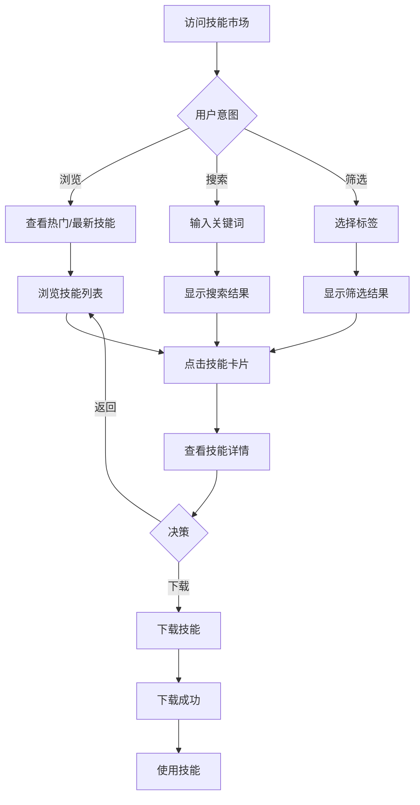

# 技能市场 - UI 设计文档

## 一、用户场景

### 目标用户
- 技能使用者：寻找、浏览、下载所需技能
- 技能开发者：发布和推广自己的技能

### 用户目标
- 快速找到需要的技能
- 了解技能的详细信息
- 下载并使用技能
- 发现热门/最新技能

### 使用场景
- 首次访问平台，浏览可用技能
- 搜索特定技能（如 Python 安全编码）
- 按标签筛选技能
- 查看热门技能推荐
- 查看最新发布的技能

## 二、用户旅程图



## 三、页面设计

### 3.1 页面布局

```
┌─────────────────────────────────────────────────────────────┐
│  Logo    技能市场    我的技能    管理        [用户头像]     │
├─────────────────────────────────────────────────────────────┤
│                                                             │
│  ┌─────────────────────────────────────────────────────┐   │
│  │  🔍 搜索技能...                                      │   │
│  └─────────────────────────────────────────────────────┘   │
│                                                             │
│  ┌─────────┐ ┌─────────┐ ┌─────────┐ ┌─────────┐          │
│  │ python  │ │ rust    │ │ security│ │ cli     │          │
│  └─────────┘ └─────────┘ └─────────┘ └─────────┘          │
│                                                             │
│  ═══ 热门技能 ════════════════════════════════════════     │
│  ┌─────────────┐ ┌─────────────┐ ┌─────────────┐           │
│  │ 🔥 Python   │ │ 🔥 Rust     │ │ 🔥 TypeScript│           │
│  │ 安全编码规范 │ │ CLI 开发指南│ │ 最佳实践     │           │
│  │ ⬇️ 1000     │ │ ⬇️ 800      │ │ ⬇️ 600      │           │
│  └─────────────┘ └─────────────┘ └─────────────┘           │
│                                                             │
│  ═══ 最新发布 ════════════════════════════════════════     │
│  ┌─────────────┐ ┌─────────────┐ ┌─────────────┐           │
│  │ 🆕 Go 并发  │ │ 🆕 Docker   │ │ 🆕 K8s      │           │
│  │ 编程模式    │ │ 部署最佳实践│ │ 配置管理    │           │
│  │ ⬇️ 50       │ │ ⬇️ 30       │ │ ⬇️ 20       │           │
│  └─────────────┘ └─────────────┘ └─────────────┘           │
│                                                             │
│  ═══ 全部技能 ════════════════════════════════════════     │
│  ┌─────────────┐ ┌─────────────┐ ┌─────────────┐           │
│  │ Python 分析 │ │ Rust Web    │ │ Vue 组件    │           │
│  │ 工具        │ │ 开发        │ │ 开发        │           │
│  └─────────────┘ └─────────────┘ └─────────────┘           │
│                                                             │
│  ┌─────────────────────────────────────────────────────┐   │
│  │                    加载更多                          │   │
│  └─────────────────────────────────────────────────────┘   │
│                                                             │
└─────────────────────────────────────────────────────────────┘
```

### 3.2 技能卡片设计

```
┌─────────────────────────────┐
│  🔥 热门  │  v1.2.0         │
│                             │
│  Python 安全编码规范         │
│  python-security            │
│                             │
│  基于 OWASP 的安全编码最佳  │
│  实践，涵盖常见安全漏洞...   │
│                             │
│  ┌─────┐┌─────┐┌─────────┐  │
│  │python││security││owasp │  │
│  └─────┘└─────┘└─────────┘  │
│                             │
│  ⬇️ 1,234    📅 2024-01-15  │
└─────────────────────────────┘
```

### 3.3 交互流程

| 操作 | 系统响应 | 结果 |
|------|---------|------|
| 输入搜索关键词 | 前端过滤/后端搜索 | 显示匹配结果 |
| 点击标签 | 筛选包含该标签的技能 | 显示筛选结果 |
| 点击技能卡片 | 路由跳转 | 显示技能详情页 |
| 点击"加载更多" | 请求下一页数据 | 追加技能列表 |
| 点击"清除筛选" | 重置筛选条件 | 显示全部技能 |

## 四、状态设计

### 4.1 加载状态

**首页加载**：
- 显示 loading 动画
- 显示骨架屏（可选）
- 禁用搜索和筛选

**加载更多**：
- 底部显示加载中提示
- 按钮显示 loading 状态
- 列表仍可滚动

### 4.2 空数据状态

**无搜索结果**：
```
┌─────────────────────────────┐
│                             │
│      🔍                     │
│                             │
│   未找到匹配的技能           │
│   请尝试其他关键词或标签     │
│                             │
│   [查看全部技能]            │
│                             │
└─────────────────────────────┘
```

**无技能数据（平台刚上线）**：
```
┌─────────────────────────────┐
│                             │
│      📦                     │
│                             │
│   暂无技能                   │
│   成为第一个发布技能的人！   │
│                             │
│   [发布技能]                │
│                             │
└─────────────────────────────┘
```

### 4.3 错误状态

**网络错误**：
```
┌─────────────────────────────┐
│                             │
│      ❌                     │
│                             │
│   加载失败                   │
│   请检查网络连接后重试       │
│                             │
│   [重试]                    │
│                             │
└─────────────────────────────┘
```

### 4.4 成功状态

**搜索成功**：
- 显示结果数量
- 显示搜索关键词
- 提供清除筛选按钮

**筛选成功**：
- 高亮选中的标签
- 显示筛选结果数量

## 五、组件清单

| 组件名 | 用途 | 状态 |
|--------|------|------|
| AppLayout | 页面布局容器 | ✅ 已实现 |
| SearchBar | 搜索栏组件 | ✅ 已实现 |
| SkillCard | 技能卡片组件 | ✅ 已实现 |
| Button | 按钮组件 | ✅ 已实现 |
| Tag | 标签组件 | ✅ 已实现 |

## 六、设计决策

### 决策1：三段式展示（热门/最新/全部）

- **原因**：满足不同用户需求
- **用户场景**：
  - 新用户：浏览热门技能，快速上手
  - 老用户：关注最新发布，保持更新
  - 搜索用户：浏览全部技能

### 决策2：标签筛选 + 关键词搜索

- **原因**：提供灵活的查找方式
- **实现**：
  - 标签筛选：精确匹配，快速定位
  - 关键词搜索：模糊匹配，范围更广

### 决策3：分页加载而非无限滚动

- **原因**：
  - 用户可以控制加载时机
  - 减少初始加载压力
  - 支持跳转到指定页（未来）

## 七、API 依赖

| API | 用途 | 状态 |
|-----|------|------|
| GET /api/skills | 获取技能列表 | ✅ 已实现 |
| GET /api/skills?q={keyword} | 搜索技能 | ✅ 已实现 |
| GET /api/skills?tags={tag} | 按标签筛选 | ✅ 已实现 |
| GET /api/skills?page={n} | 分页加载 | ✅ 已实现 |

## 八、待改进项

- [ ] 添加排序选项（下载量/时间/名称）
- [ ] 添加高级搜索（多标签组合）
- [ ] 添加技能收藏功能
- [ ] 添加个性化推荐