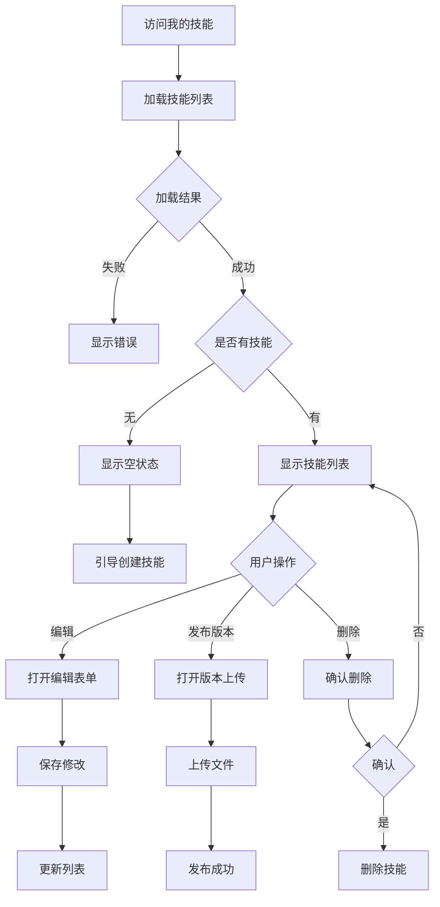

# 我的技能 - UI 设计文档

## 一、用户场景

### 目标用户
- 技能开发者：管理自己发布的技能

### 用户目标
- 查看自己创建的技能
- 编辑技能信息
- 发布新版本
- 删除技能

### 使用场景
- 查看自己发布的所有技能
- 更新技能描述或标签
- 发布技能新版本
- 下架不再维护的技能

## 二、用户旅程图



## 三、页面设计

### 3.1 页面布局

```
┌─────────────────────────────────────────────────────────────┐
│  Logo    技能市场    我的技能    管理        [用户头像]     │
├─────────────────────────────────────────────────────────────┤
│                                                             │
│  我的技能                                                   │
│  管理您创建的技能                                           │
│                                                             │
│  ┌─────────────────────────────────────────────────────┐   │
│  │                    + 创建技能                        │   │
│  └─────────────────────────────────────────────────────┘   │
│                                                             │
│  ┌─────────────────────────────────────────────────────┐   │
│  │  Python 安全编码规范                v1.2.0          │   │
│  │  python-security                                     │   │
│  │  基于 OWASP 的安全编码最佳实践...                    │   │
│  │  ⬇️ 1,234    📅 2024-01-15                          │   │
│  │                                                     │   │
│  │  [编辑]  [发布新版本]  [删除]                        │   │
│  └─────────────────────────────────────────────────────┘   │
│                                                             │
│  ┌─────────────────────────────────────────────────────┐   │
│  │  Rust CLI 开发指南                  v0.1.0          │   │
│  │  rust-cli-guide                                      │   │
│  │  Rust 命令行工具开发最佳实践...                      │   │
│  │  ⬇️ 567      📅 2024-01-10                          │   │
│  │                                                     │   │
│  │  [编辑]  [发布新版本]  [删除]                        │   │
│  └─────────────────────────────────────────────────────┘   │
│                                                             │
└─────────────────────────────────────────────────────────────┘
```

### 3.2 空状态设计

```
┌─────────────────────────────────────┐
│                                     │
│           📦                        │
│                                     │
│      您还没有创建任何技能           │
│                                     │
│   创建您的第一个技能，分享给社区     │
│                                     │
│        [创建技能]                   │
│                                     │
└─────────────────────────────────────┘
```

## 四、状态设计

### 4.1 加载状态
- 显示 loading 动画
- 禁用创建按钮

### 4.2 空数据状态
- 显示空状态插图
- 显示引导文案
- 提供创建按钮

### 4.3 错误状态
- 显示错误提示
- 提供重试按钮

### 4.4 成功状态
- 操作成功后显示 Toast 提示
- 自动刷新列表

## 五、API 依赖

| API | 用途 | 状态 |
|-----|------|------|
| GET /api/users/me/skills | 获取我的技能列表 | ✅ 已实现 |
| PUT /api/skills/{slug} | 更新技能 | ✅ 已实现 |
| DELETE /api/skills/{slug} | 删除技能 | ✅ 已实现 |
| POST /api/skills/{slug}/versions | 创建新版本 | ✅ 已实现 |

## 六、待改进项

- [ ] 添加技能统计信息（下载趋势）
- [ ] 添加批量操作功能
- [ ] 添加技能状态切换（公开/私有）