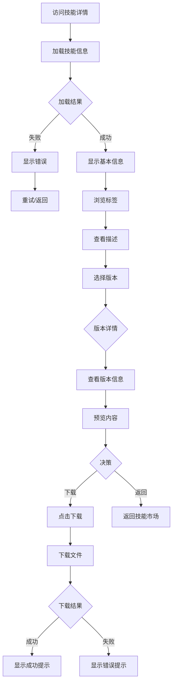

# 技能详情 - UI 设计文档

## 一、用户场景

### 目标用户
- 技能使用者：查看技能详细信息，决定是否下载
- 技能开发者：查看自己发布的技能

### 用户目标
- 了解技能的功能和用途
- 选择合适的版本
- 下载技能文件
- 查看 README 文档

### 使用场景
- 从技能市场点击进入
- 直接访问技能详情链接
- 查看特定版本的技能

## 二、用户旅程图



## 三、页面设计

### 3.1 页面布局

```
┌─────────────────────────────────────────────────────────────┐
│                                                             │
│  Python 安全编码规范                              v1.2.0    │
│  python-security                                            │
│                                                             │
│  ┌─────┐ ┌─────────┐ ┌────────┐ ┌──────────┐              │
│  │python│ │security│ │owasp   │ │best-practice│             │
│  └─────┘ └─────────┘ └────────┘ └──────────┘              │
│                                                             │
│  基于 OWASP 的安全编码最佳实践，涵盖常见安全漏洞的          │
│  防护方法，适用于 Python 3.x 项目开发...                    │
│                                                             │
├─────────────────────────────────────────────────────────────┤
│  版本选择                                                   │
│                                                             │
│  选择版本: [ latest (v1.2.0) ▼ ]                           │
│                                                             │
│  ┌─────────────────────────────────────────────────────┐   │
│  │  版本标签: latest                                    │   │
│  │  版本号: v1.2.0                                      │   │
│  │  Digest: abc123456789...                            │   │
│  │                                                     │   │
│  │  内容预览:                                           │   │
│  │  ┌─────────────────────────────────────────────┐   │   │
│  │  │ # Python 安全编码规范                        │   │   │
│  │  │                                             │   │   │
│  │  │ ## 1. SQL 注入防护                          │   │   │
│  │  │ 使用参数化查询，避免字符串拼接...             │   │   │
│  │  └─────────────────────────────────────────────┘   │   │
│  └─────────────────────────────────────────────────────┘   │
│                                                             │
│  更新时间: 2024-01-15 10:30                                 │
│                                                             │
├─────────────────────────────────────────────────────────────┤
│  README                                                     │
│                                                             │
│  ┌─────────────────────────────────────────────────────┐   │
│  │  # Python 安全编码规范                               │   │
│  │                                                     │   │
│  │  ## 简介                                            │   │
│  │  本技能提供 Python 安全编码的最佳实践...             │   │
│  │                                                     │   │
│  │  ## 使用方法                                        │   │
│  │  1. 下载技能文件                                    │   │
│  │  2. 解压到项目目录                                  │   │
│  │  ...                                                │   │
│  └─────────────────────────────────────────────────────┘   │
│                                                             │
├─────────────────────────────────────────────────────────────┤
│  ⬇️ 1,234 次下载        [返回列表]  [下载技能]              │
│                                                             │
└─────────────────────────────────────────────────────────────┘
```

### 3.2 版本选择器设计

```
┌─────────────────────────────────────────┐
│  选择版本:                               │
│  ┌─────────────────────────────────┐    │
│  │ latest (v1.2.0)           ▼    │    │
│  └─────────────────────────────────┘    │
│                                         │
│  下拉选项:                               │
│  ┌─────────────────────────────────┐    │
│  │ latest (v1.2.0)         ✓      │    │
│  ├─────────────────────────────────┤    │
│  │ v1.2.0                         │    │
│  │ v1.1.0                         │    │
│  │ v1.0.0                         │    │
│  └─────────────────────────────────┘    │
└─────────────────────────────────────────┘
```

### 3.3 交互流程

| 操作 | 系统响应 | 结果 |
|------|---------|------|
| 切换版本标签 | 加载版本详情 | 显示版本信息和内容预览 |
| 点击"下载技能" | 发起下载请求 | 下载文件/显示错误 |
| 点击"返回列表" | 路由跳转 | 返回技能市场 |
| 点击"重试" | 重新加载数据 | 刷新页面内容 |

## 四、状态设计

### 4.1 加载状态

**初始加载**：
```
┌─────────────────────────────────────┐
│                                     │
│         ⏳ 加载中...                │
│                                     │
└─────────────────────────────────────┘
```

**版本切换加载**：
- 显示"加载版本详情..."
- 保持基本信息不变
- 版本详情区域显示 loading

### 4.2 空数据状态

**技能不存在**：
```
┌─────────────────────────────────────┐
│                                     │
│          ❌ 技能不存在              │
│                                     │
│   该技能可能已被删除或链接错误       │
│                                     │
│        [返回技能市场]               │
│                                     │
└─────────────────────────────────────┘
```

**无版本数据**：
```
┌─────────────────────────────────────┐
│                                     │
│          📦 暂无版本                │
│                                     │
│   该技能尚未发布任何版本             │
│                                     │
└─────────────────────────────────────┘
```

### 4.3 错误状态

**加载失败**：
```
┌─────────────────────────────────────┐
│                                     │
│          ❌ 加载失败                │
│                                     │
│   网络连接失败，请重试               │
│                                     │
│      [重试]  [返回首页]             │
│                                     │
└─────────────────────────────────────┘
```

**下载失败**：
```
┌─────────────────────────────────────┐
│  ⚠️ 下载失败: 网络连接中断           │
│                                     │
│      [重试下载]                     │
└─────────────────────────────────────┘
```

### 4.4 成功状态

**下载成功**：
```
┌─────────────────────────────────────┐
│  ✅ 下载成功！                       │
│  文件: python-security-latest.tar.gz │
│                                     │
│  解压后即可使用                      │
└─────────────────────────────────────┘
```

**Toast 提示**（推荐）：
- 成功：绿色背景，显示 3 秒后自动消失
- 失败：红色背景，需手动关闭或 5 秒后消失

## 五、组件清单

| 组件名 | 用途 | 状态 |
|--------|------|------|
| AppLayout | 页面布局容器 | ⚠️ 未使用（需添加） |
| Button | 按钮组件 | ✅ 已实现 |
| Tag | 标签组件 | ✅ 已实现 |
| Select | 下拉选择器 | ✅ 已实现（原生 select） |
| Toast | 提示消息 | ❌ 缺失（需添加） |

## 六、设计决策

### 决策1：Docker Tag 模式的版本管理

- **原因**：灵活、直观、易于理解
- **实现**：
  - `latest` - 最新版本
  - `v1.2.0` - 指定版本
  - `v1` - 自动匹配 v1.x.x 最新

### 决策2：版本内容预览

- **原因**：用户在下载前可预览技能内容
- **实现**：显示前 500 字符的预览

### 决策3：直接下载文件

- **原因**：简单直接，符合用户预期
- **替代方案**：CLI 下载
- **选择理由**：Web 端优先简单操作

## 七、API 依赖

| API | 用途 | 状态 |
|-----|------|------|
| GET /api/skills/{slug} | 获取技能详情 | ✅ 已实现 |
| GET /api/skills/{slug}/tags | 获取版本标签列表 | ✅ 已实现 |
| GET /api/skills/{slug}/{tag} | 获取指定版本详情 | ✅ 已实现 |
| GET /api/skills/{slug}/download/{tag} | 下载技能文件 | ✅ 已实现 |

## 八、待改进项

### 当前实现缺失

| 问题 | 影响 | 优先级 |
|------|------|--------|
| 缺少加载失败重试机制 | 用户无法恢复 | P0 |
| 缺少下载成功/失败反馈 | 用户体验差 | P0 |
| 未使用 AppLayout | 布局不一致 | P1 |

### 功能改进

- [ ] 添加 Toast 通知组件
- [ ] 添加重试按钮
- [ ] 添加下载进度显示
- [ ] 添加技能评分功能
- [ ] 添加相关技能推荐